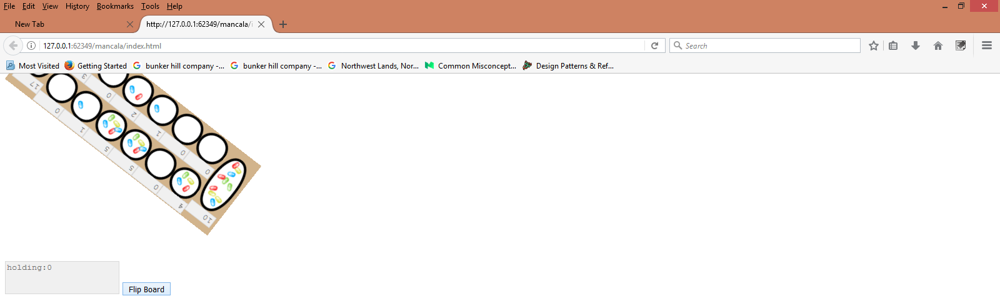

# coding challenge mancala

While working on this project I learned about the difference between creating objects with classes and constructors and creating objects with prototypal inheritance and creating objects with factory functions with Object.assign() and Object.create(). I implemented only a small part of what I learned. ..mostly just concatenating objects with Object.assign().
